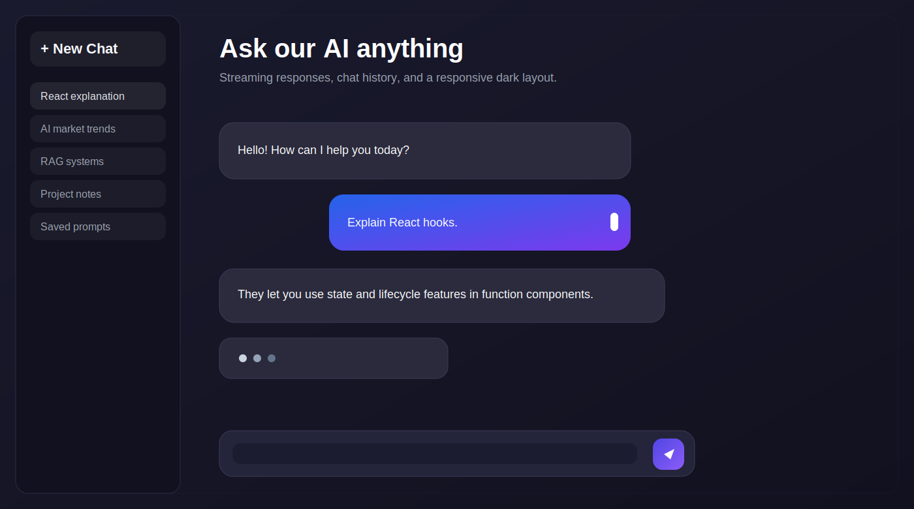

# AI Chat Interface



A modern full-stack AI chat UI built with React, Vite, Tailwind CSS, Express, and Groq. It supports streamed assistant replies, chat history, and a dark ChatGPT-style layout with a responsive sidebar.

## Features

- Dark mode chat experience with a centered conversation area
- Left sidebar for chat history and starting a new chat
- Streaming AI responses so text appears chunk by chunk
- Active chat state so continuing a thread updates the same history item
- Responsive layout for desktop and mobile screens
- Fixed composer bar at the bottom for fast message entry

## Tech Stack

- React 19
- Vite
- Tailwind CSS 4
- Express
- Groq SDK
- CORS
- dotenv

## How to Run Locally

### 1. Install dependencies

Run this in each app folder:

```bash
cd client
npm install

cd ../server
npm install
```

### 2. Add your environment variable

Create a `.env` file inside `server/`:

```env
GROQ_API_KEY=your_groq_api_key_here
CHUNK_DELAY_MS=20
```

`CHUNK_DELAY_MS` is optional. It only adds a small delay between streamed chunks.

### 3. Start the backend

```bash
cd server
node server.js
```

The API runs on `http://localhost:3000`.

### 4. Start the frontend

Open a second terminal:

```bash
cd client
npm run dev
```

The app runs on the Vite dev server, usually `http://localhost:5173`.

## What I Learned

- How to handle streamed AI responses in React by updating state as chunks arrive
- Why chat history needs an active conversation ID to avoid duplicating threads
- How to keep the UI and saved history in sync when a reply is still streaming
- How Tailwind can replace a separate CSS file cleanly for a dark, responsive chat layout
- How a small Express backend can proxy the model request and keep the frontend simple
